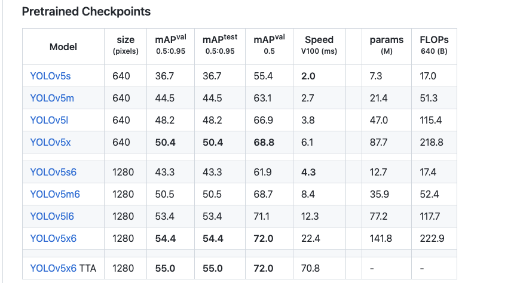

# DJL run Pytorch YoLov5

# 依赖环境

## DJL Deep Java Library

github : [https://github.com/deepjavalibrary/djl](https://github.com/deepjavalibrary/djl)

website:  [https://djl.ai/](https://djl.ai/)

books: [https://d2l.djl.ai/](https://d2l.djl.ai/)

maven: [http://djl.ai/bom/](http://djl.ai/bom/)

## Pytorch TorchScript

[https://pytorch.org/docs/1.8.1/jit.html](https://pytorch.org/docs/1.8.1/jit.html)

## YoLov5

github: [https://github.com/ultralytics/yolov5](https://github.com/ultralytics/yolov5)

export TorchScirpt : [https://github.com/ultralytics/yolov5/issues/251](https://github.com/ultralytics/yolov5/issues/251)

# 模型训练与导出

- 训练模型

  基于YoLov5 教程来训练自己的模型 ([https://github.com/ultralytics/yolov5/wiki/Train-Custom-Data](https://github.com/ultralytics/yolov5/wiki/Train-Custom-Data))

- 导出Pytorch TorchScript

    ```java
    python [export.py](http://export.py/) --weights [yolov5s.pt](http://yolov5s.pt/) --img 640 --batch 1
    ```

  weights:是模型的路径 例如:./models/best.pt

  img:是模型的输入大小 根据yolov5的s x l 来设置对应的大小

  

export.py参数定义:


## 基于DJL使用模型

maven

```java
        <dependency>
            <groupId>commons-cli</groupId>
            <artifactId>commons-cli</artifactId>
            <version>1.4</version>
        </dependency>

        <dependency>
            <groupId>ai.djl</groupId>
            <artifactId>basicdataset</artifactId>
        </dependency>
        <dependency>
            <groupId>ai.djl</groupId>
            <artifactId>api</artifactId>
        </dependency>

        <dependency>
            <groupId>ai.djl</groupId>
            <artifactId>model-zoo</artifactId>
        </dependency> 

      <dependency>
            <groupId>ai.djl.pytorch</groupId>
            <artifactId>pytorch-engine</artifactId>
            <version>0.11.0</version>
        </dependency>
        <dependency>
            <groupId>ai.djl.pytorch</groupId>
            <artifactId>pytorch-model-zoo</artifactId>
            <version>0.11.0</version>
        </dependency>
        <dependency>
            <groupId>ai.djl.pytorch</groupId>
            <artifactId>pytorch-native-auto</artifactId>
            <version>1.8.1</version>
        </dependency>
```

YoLoImageUtils.class

```java
import ai.djl.modality.cv.output.BoundingBox;
import ai.djl.modality.cv.output.DetectedObjects;
import ai.djl.modality.cv.output.Landmark;
import ai.djl.modality.cv.output.Mask;
import ai.djl.util.RandomUtils;

import java.awt.*;
import java.awt.image.BufferedImage;
import java.util.List;

/**
 * @author lorne
 * @since 1.0.0
 * @see ai.djl.modality.cv.BufferedImageFactory.BufferedImageWrapper
 */
public class YoLoImageUtils {

    private static Color randomColor() {
        return new Color(RandomUtils.nextInt(255));
    }

    public static void drawBoundingBoxes(BufferedImage image, DetectedObjects detections) {
        Graphics2D g = (Graphics2D) image.getGraphics();
        int stroke = 2;
        g.setStroke(new BasicStroke(stroke));
        g.setRenderingHint(RenderingHints.KEY_ANTIALIASING, RenderingHints.VALUE_ANTIALIAS_ON);

        int imageWidth = image.getWidth();
        int imageHeight = image.getHeight();

        List<DetectedObjects.DetectedObject> list = detections.items();
        for (DetectedObjects.DetectedObject result : list) {
            String className = result.getClassName();
            BoundingBox box = result.getBoundingBox();
            g.setPaint(randomColor().darker());

            ai.djl.modality.cv.output.Rectangle rectangle = box.getBounds();
            int x = (int) (rectangle.getX() );
            int y = (int) (rectangle.getY() );
            g.drawRect(
                    x,
                    y,
                    (int) (rectangle.getWidth() ),
                    (int) (rectangle.getHeight()));
            drawText(g, className, x, y, stroke, 4);
            // If we have a mask instead of a plain rectangle, draw tha mask
            if (box instanceof Mask) {
                Mask mask = (Mask) box;
                drawMask(image, mask);
            } else if (box instanceof Landmark) {
                drawLandmarks(image, box);
            }
        }
        g.dispose();
    }

    private static void drawLandmarks(BufferedImage image, BoundingBox box) {
        Graphics2D g = (Graphics2D) image.getGraphics();
        g.setColor(new Color(246, 96, 0));
        BasicStroke bStroke = new BasicStroke(4, BasicStroke.CAP_BUTT, BasicStroke.JOIN_MITER);
        g.setStroke(bStroke);
        for (ai.djl.modality.cv.output.Point point : box.getPath()) {
            g.drawRect((int) point.getX(), (int) point.getY(), 2, 2);
        }
        g.dispose();
    }

    private static void drawText(Graphics2D g, String text, int x, int y, int stroke, int padding) {
        FontMetrics metrics = g.getFontMetrics();
        x += stroke / 2;
        y += stroke / 2;
        int width = metrics.stringWidth(text) + padding * 2 - stroke / 2;
        int height = metrics.getHeight() + metrics.getDescent();
        int ascent = metrics.getAscent();
        java.awt.Rectangle background = new java.awt.Rectangle(x, y, width, height);
        g.fill(background);
        g.setPaint(Color.WHITE);
        g.drawString(text, x + padding, y + ascent);
    }

    private static void drawMask(BufferedImage image, Mask mask) {
        float r = RandomUtils.nextFloat();
        float g = RandomUtils.nextFloat();
        float b = RandomUtils.nextFloat();
        int imageWidth = image.getWidth();
        int imageHeight = image.getHeight();
        int x = (int) (mask.getX() * imageWidth);
        int y = (int) (mask.getY() * imageHeight);
        float[][] probDist = mask.getProbDist();
        // Correct some coordinates of box when going out of image
        if (x < 0) {
            x = 0;
        }
        if (y < 0) {
            y = 0;
        }

        BufferedImage maskImage =
                new BufferedImage(
                        probDist.length, probDist[0].length, BufferedImage.TYPE_INT_ARGB);
        for (int xCor = 0; xCor < probDist.length; xCor++) {
            for (int yCor = 0; yCor < probDist[xCor].length; yCor++) {
                float opacity = probDist[xCor][yCor];
                if (opacity < 0.1) {
                    opacity = 0f;
                }
                if (opacity > 0.8) {
                    opacity = 0.8f;
                }
                maskImage.setRGB(xCor, yCor, new Color(r, g, b, opacity).darker().getRGB());
            }
        }
        Graphics2D gR = (Graphics2D) image.getGraphics();
        gR.drawImage(maskImage, x, y, null);
        gR.dispose();
    }
}
```

YoLov5 Model Test :

```java
import ai.djl.inference.Predictor;
import ai.djl.modality.cv.Image;
import ai.djl.modality.cv.ImageFactory;
import ai.djl.modality.cv.output.DetectedObjects;
import ai.djl.modality.cv.transform.Resize;
import ai.djl.modality.cv.transform.ToTensor;
import ai.djl.modality.cv.translator.YoloV5Translator;
import ai.djl.repository.zoo.Criteria;
import ai.djl.repository.zoo.ModelZoo;
import ai.djl.repository.zoo.ZooModel;
import ai.djl.training.util.ProgressBar;
import ai.djl.translate.Pipeline;
import ai.djl.translate.Translator;
import lombok.extern.slf4j.Slf4j;

import java.awt.image.BufferedImage;
import java.nio.file.Files;
import java.nio.file.Path;
import java.nio.file.Paths;
import java.util.Arrays;

/**
 * @author lorne
 * @since 1.0.0
 *
 * https://github.com/deepjavalibrary/djl/issues/901
 * https://www.programmersought.com/article/65958865963/
 * https://pytorch.org/docs/1.8.1/jit.html
 */
@Slf4j
public class MainTest {

    public static void main(String[] args) throws Exception{
        //输入图片的大小 对应导出torchscript的大小
        int imageSize = 640;
        //图片处理步骤
        Pipeline pipeline = new Pipeline();
        pipeline.add(new Resize(imageSize)); //调整尺寸
        pipeline.add(new ToTensor()); //处理为tensor类型
        //定义YoLov5的Translator
        Translator<Image, DetectedObjects> translator =  YoloV5Translator
                .builder()
                .setPipeline(pipeline)
                //labels信息定义
//                .optSynsetArtifactName("coco.names") //数据的labels文件名称
                .optSynset(Arrays.asList("qinggangwa","dapeng","dapengs")) //数据的labels数据
                //预测的最小下限
                .optThreshold(0.5f)
                .build();

        //构建Model Criteria
        Criteria<Image, DetectedObjects> criteria = Criteria.builder()
                .setTypes(Image.class, DetectedObjects.class)//图片目标检测类型
                .optModelUrls(Paths.get("build/yolov5").toFile().getPath())//模型的路径
                .optModelName("best.torchscript.pt")//模型的文件名称
                .optTranslator(translator)//设置Translator
                .optProgress(new ProgressBar())//展示加载进度
                .build();
        //加载Model
        ZooModel<Image,DetectedObjects> model = ModelZoo.loadModel(criteria);
        //加载图片
        Image img = ImageFactory.getInstance().fromFile(Paths.get("build/files/DSC00020_0.jpg"));
        //创建预测对象
        Predictor<Image, DetectedObjects> predictor = model.newPredictor();
        //预测图片
        DetectedObjects results = predictor.predict(img);
        System.out.println(results);
        //创建用于保存的预测结果
        Path outputDir = Paths.get("build/output");
        Files.createDirectories(outputDir);
        //在预测结果上画出标记框
        YoLoImageUtils.drawBoundingBoxes((BufferedImage) img.getWrappedImage(),results);
        //保存文件名称
        Path imagePath = outputDir.resolve("detected-DSC00020_0.png");
        // OpenJDK can't save jpg with alpha channel
        img.save(Files.newOutputStream(imagePath), "png");
        log.info("Detected objects image has been saved in: {}", imagePath);
    }

}
```

运行效果:


参考资料:

- https://github.com/deepjavalibrary/djl/issues/901
- https://www.programmersought.com/article/65958865963/
- https://pytorch.org/docs/1.8.1/jit.html

## TODO
* 图片压缩然后在还原标记
